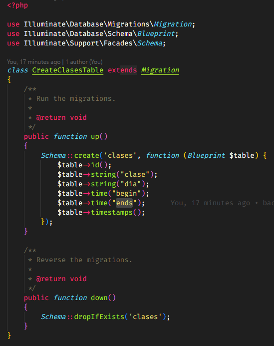

# laravel-eiatec

# Introduccion

Se muestra los endpoints que se realizaron para esta prueba tecnica

# Requisitos
1. Tener instalado composer
2. PHP 8.1 en adelante

# Ejecucion

```
php artisan serve
```

# Migracion



# Endpoints

```

prefijo api: http://localhost:8000/api

1. GET /list?page=1 
* lista las clases 
* page por defecto lista los de la primera pagina

Ejemplo: http://localhost:8000/api/list?page=2

2. POST /add
* agrega una nueva clase
* el request body se debe enviar de esta forma

{
	"clase": "Fisica",
	"dia": "Jueves",
	"begin": "10:00:00",
	"ends": "11:00:00"
}

Ejemplo: http://localhost:8000/api/add

3. PUT /edit/{id}
* edita una clase
* se envia el mismo json cuando agregas
* requiere el id para hacer el cambio

Ejemplo: http://localhost:8000/api/edit/2

4. DELETE /delete/{id}
* elimina una clase
* requiere el id para eliminarlo

Ejemplo: http://localhost:8000/api/delete/2

```